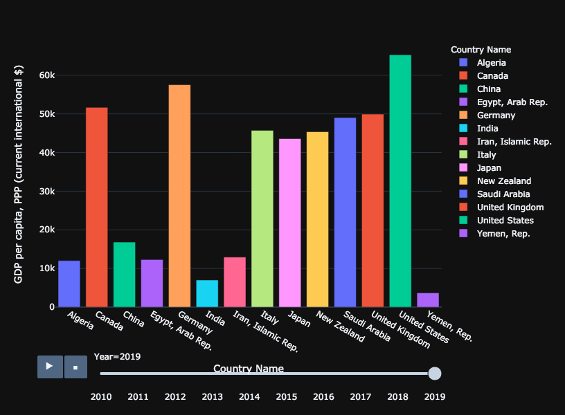
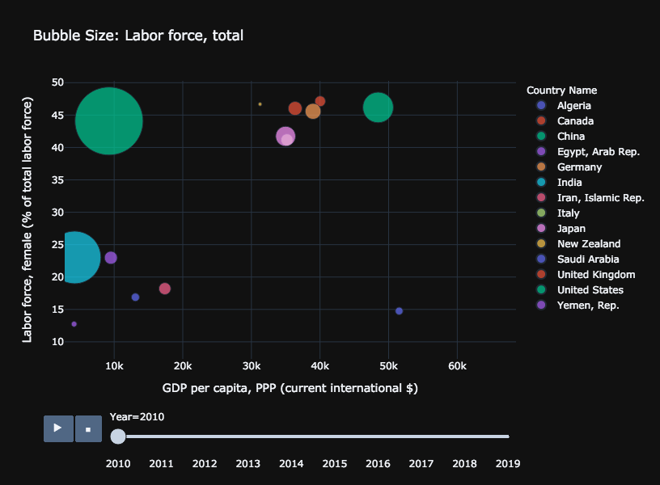
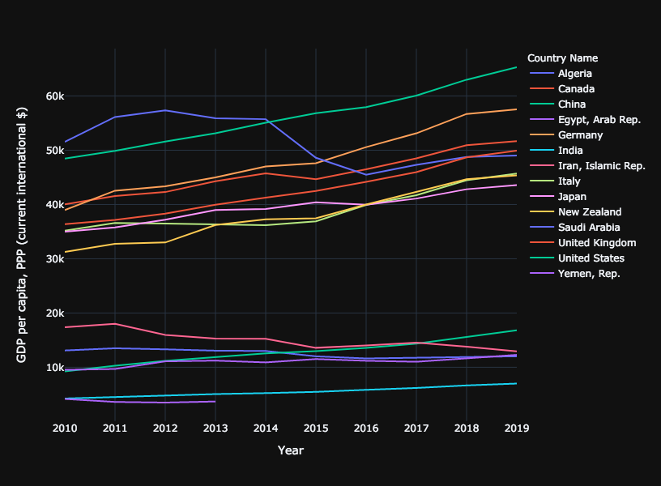

*Image from: builtin.com*
# The increase of women in the workplace drives an increase in GDP

**Author**: Shaimar R. González Morales

**Date**: 3/28/2021

United Stated have seing an increase in women in the workplace since 1930 and 1970 and this increase continues (1). Nevertheless, payment inequality in different work sectors remains a big issue but stigma around working married women in the US has reduced (1). The recent movie "Picture a Scientist" highlight that although the stigma have being reduce, the discrimination against women in the workplace has not (2). In the movie it showcase a study that was performed where a female can submit a CV or resume with the same credentials than the male and the male always recieved a better feedback than the female applicant (2). 

*Image from: nederlia.com*

The descrimination against female names in applications does not even account for the discrimination either sexual or gender base that many women face once that they are hired. Unfortanetlly many countries doesn't have laws that proctec women in the workplace. Also, many countries doesn't have equality when referring to education, which can also contribute to less women in the workplace.

*Image from: https://www.cfr.org/womens-participation-in-global-economy/*

In many countries of these counrties there still a high level of stigma of women being in the workplace. The World Bank showed that 15 countries with less women in the workplace belong Middle East and North Africa (MENA) in 2015 (3). Despite that in many cases females were outperforming their male counterparts (3). The patriarcal society in these countries and the lack of rules that protect women in the workplaces not only towards harrasment but that guarantee equal payment is pushing women out of the workforce if they even get the job in the first place. According to El-Swais article, Morocco from this list of counties is the only one that by 2015 had laws again gender discrimination during hiring and equal payment and Algeria joined later with laws that also protect equal payment (3).

*Image from: https://blogs.worldbank.org/arabvoices/despite-high-education-levels-arab-women-still-don-t-have-jobs*

El-Sawais said that these gap between male and female in the workplace produce a 27% loss in income in these countries, which makes you question then why they still are following this practices.

I utilized some of the data from World Bank to explore the percentage of women in the workforce in countries of highest GDP and compare with some countries with low women in the workforce to determine if is seems to be a trend. This is very important not only to help increase the women in the workforce in other countries but also in increase equity in the workplace especially in the STEM fields. Due to the recent pandemic women have suffer more due to deal with child care, and child education will still working, as most of daycare were close or not safe during these times. We know that the economy have suffer during the pandemic, but how much will this be because women were force to stay taking care of the children affecting their work productivity and in some cases quitting their work because of this? 

Although this database doesn't include data during the pandemic, we can determine whether the increase in the percentage of women in the workforce in other countries even if is slighthy, contribute to a higher GDP. This is important because we can go back to the literature and determine what happened during that year that stimulate the economy and what policies the counrty did to increase the number of women working. The data is obtained from http://www.worlddev.xyz/, which allow to visualize current data from the World Bank in a way that is more accessible. 

First, to performed this analysis I chose Economy and Growth (GDP per capita (cureent international $)) and Education (labor force total. The countries that were selected were Algeria, Canada, China, Egypt, Germany, India, Iran, Italy, Japan, New Zealand, Saudi Arabia, United Kingdom, United States and Yemen from 2010 to 2019. This was done as most of this countries are the ones with highest GDP and others like Yemen are ones with low  women in the workplace.

A bar graph was used just to ilustrate the amout of GDP among countries. Here in this graph we can observed that United States, Germany and Canada has the higher GDP and among the lowest are Yemen and India.

I used a buble graph to ilustrate the relation between GDP and women workforce. 

In this graph we can observed that New Zealand have a high women workforce than many countries. Nevertheless, United States and China are the countries with higher women workforce. We know that China increase in female workforce could be due to their one child policy and perhaps more favorable work evironments than other Asian countries in this list. Nevertheless we observed that Yemen, India and Iran are among the lowest in women workforce and the ones with lower GDP. We can observed that with exception of Saudi Arabia more women in the workforce correlates with more GDP.
 
 
 
Utilizing a line graph we can observed how there GDP have been growing over the years. And when we look back to Saudi Arabia we ca observed that their GDP have decrease. Not necesarily in this case due to less women in the workplace but probably due to the oil industry taking some hit. Nevertheless, if we look at New Zealand their GDP have slightly increase with a slightly increase in women in the workplace.
 
I did a search to determine what happened during this time that their was an increase in the economy with an increase in women in the workplace (4). I found that during this time there was plan that was put into place to help women get into jobs like construction and other reforms were added to help women enter the workforce and guarantee a better work environment(4). If the US and other countries follow the lead of New Zealand we can even see boost in the economy. This is not only about more people working is equal to more profits but it is also more ideas, which equals more innnovation.
 
The Growing Economies Through Gender Parity established a projection of what could happend if countries adopt gender parity in the workforce and how that will be observed in terms of GDP increase.

*Image from: https://www.cfr.org/womens-participation-in-global-economy/*

In this article we observed that althought US have 75% of gender parity there still much to be done and we should adopt policies similar to the ones of New Zealand and Canada or even go higher to potentially boost the economy (5). If the US adopt New Zealand strategies there could be an increase of even 12% which is 2.7 trillion gain and around $8,000 per person (5). 

Therefore, let's support women in the workplace and create an equal environment for everyone. Creating equality in the workplace will benefit everyone of us.

*Image from: builtin.com*

### References:

1.Yellen, Janet L. (May 2020). The history of women’s work and wages and how it has created success for us all.  https://www.brookings.edu/essay/the-history-of-womens-work-and-wages-and-how-it-has-created-success-for-us-all/

2.Pictute a Scientist: https://www.pictureascientist.com/

3.El-Swais, Maha (March 09, 2016).World Bank Blogs: Arab Voices. Despite high education levels, Arab women still don’t have jobs. https://blogs.worldbank.org/arabvoices/despite-high-education-levels-arab-women-still-don-t-have-jobs

4.Getting it done: Utilising women’s skills in the workforce. https://policygroupontradeswomen.org/wp-content/uploads/2020/08/Getting-it-done-Utilising-women%E2%80%99s-skills-in-the-workforce-Lessons-from-the-Canterbury-New-Zealand-rebuild-2015.pdf

5.Growing Economies Through Gender Parity. https://www.cfr.org/womens-participation-in-global-economy/

