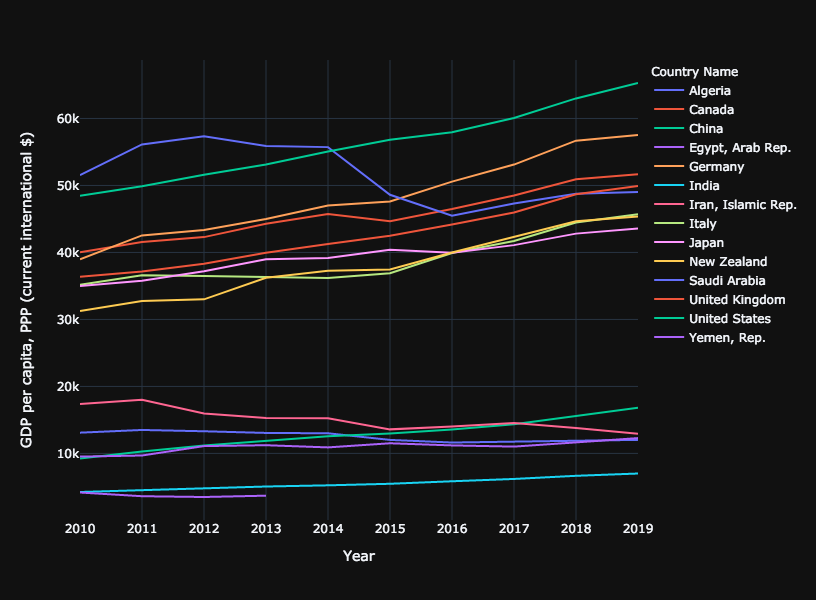

# Women in the workplace contribute to a higher GDP

**Author**: Shaimar R. González Morales

**Date**: 3/28/2021

 

You should provide a detailed introduction about the project, for example,
What is it that you are investigating/exploring/analyzing (provide sufficient background information)?
Why is it important to you and/or to others?
What questions do you have in mind and would like to answer?
Where do you get the data to help answer your questions?
What process/step you use to analyze the situation/issue
You will report the findings and your analysis of each issue/question after the introduction
Use the downloaded charts and provide explanations
You compare different countries and show similarities/differences and their implcations
You also look at the historic trend to spot any changes
You will also explore relations between different topics/indicators
For example, wealth may impact health, women's education levels may impact their employment.
Use scatter plots (2D scatter plot and/or bubble chart)

kjdj

