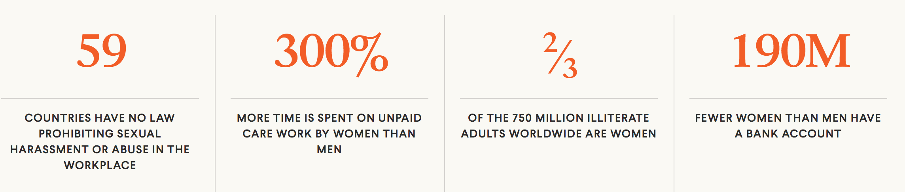
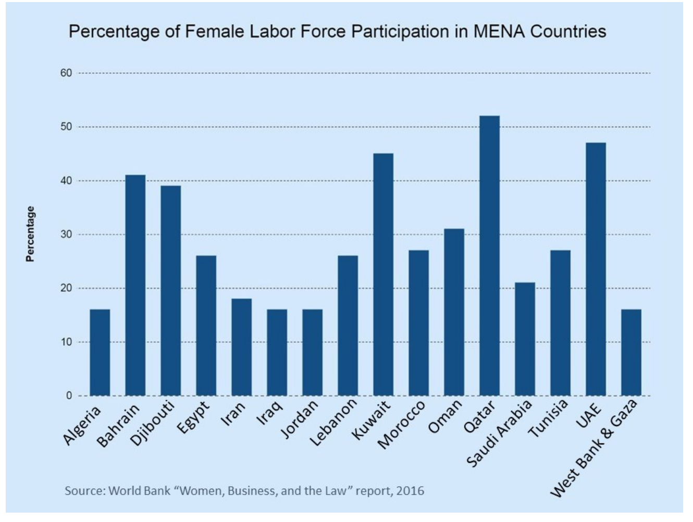
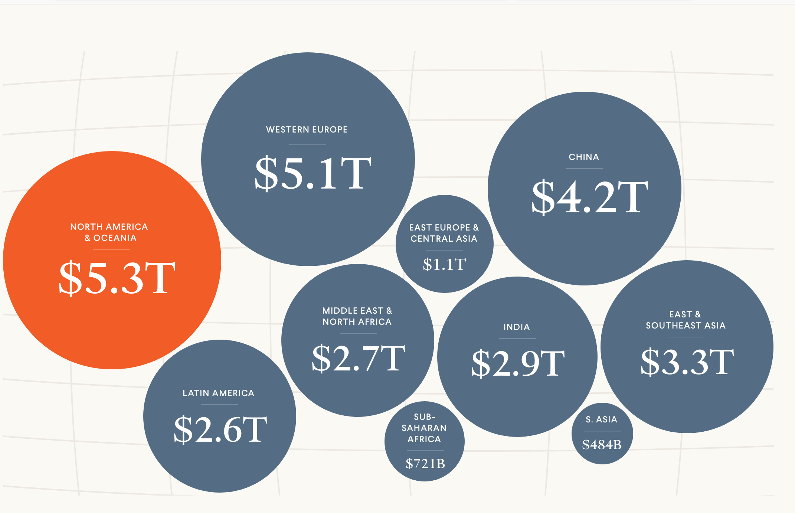

# The increase of women in the workplace drives an increase in GDP

**Author**: Shaimar R. González Morales

**Date**: 3/28/2021

United Stated saw an increase in women in the workplace since 1930 and 1970 it this increase continues (1). Nevertheless, payment inequality in different work sectors remains a big issue but stigma around working married women in the US has reduced (1). The recent movie "Picture a Scientist" highlight that although the stigma have reduce, the discrimination against women in the workplace has not (2). In the movie it showcase a study that was performed where a women can submit a CV or resume with the same credentials than man but the male always recieved better feedback than the female applicant (2). 

The descrimination against female names in applications does not even account for the discrimination either sexual or gender bases that many women face once that they are hired. And unfortanetlly many countries doesn't have laws that proctec women in the workplace. Also, many countries doesn't have equality when referring to education. 

Image from: *https://www.cfr.org/womens-participation-in-global-economy/*

In many countries the still a high level of stigma of women being in the workplace. The World Bank showed that 15 countries with less women in the workplace belong Middle East and North Africa (MENA) in 2015 (3). Despite that in many cases females were outperforming their male counterparts (3). The patriarcal society in this countries and the lack of rules that protect women in the workplaces not only towards harrasment but for equal payment is pushing women out of the workforce if they even get the job. According to El-Swais article Morocco from these counties is the only one that by 2015 had laws again gender discrimination during hiring and equal payment, while Algeria joined later with equal payment (3).

Image from: https://blogs.worldbank.org/arabvoices/despite-high-education-levels-arab-women-still-don-t-have-jobs

El-Sawais said that these gap between male and female in the workplace produce a 27% loss in income in these countries. 

You should provide a detailed introduction about the project, for example,
What is it that you are investigating/exploring/analyzing (provide sufficient background information)?
Why is it important to you and/or to others?
What questions do you have in mind and would like to answer?
Where do you get the data to help answer your questions?
What process/step you use to analyze the situation/issue

You will report the findings and your analysis of each issue/question after the introduction
Use the downloaded charts and provide explanations

You compare different countries and show similarities/differences and their implcations
You also look at the historic trend to spot any changes

You will also explore relations between different topics/indicators
For example, wealth may impact health, women's education levels may impact their employment.
Use scatter plots (2D scatter plot and/or bubble chart)

Image from: https://www.cfr.org/womens-participation-in-global-economy/

### References:

1.Yellen, Janet L. (May 2020). The history of women’s work and wages and how it has created success for us all.  https://www.brookings.edu/essay/the-history-of-womens-work-and-wages-and-how-it-has-created-success-for-us-all/

2.Pictute a Scientist: https://www.pictureascientist.com/

3.El-Swais, Maha (March 09, 2016).World Bank Blogs: Arab Voices. Despite high education levels, Arab women still don’t have jobs. https://blogs.worldbank.org/arabvoices/despite-high-education-levels-arab-women-still-don-t-have-jobs

